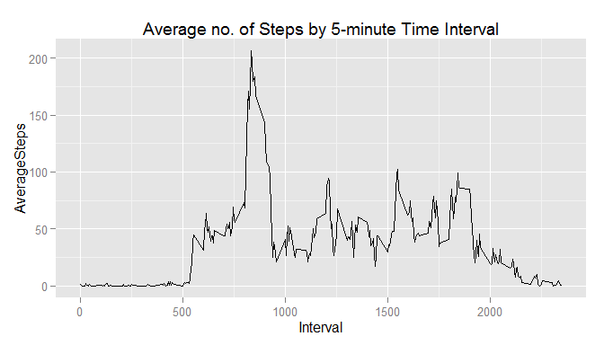

# Reproducible Research: Peer Assessment 1

This repository is forked/cloned from a github [page][http://github.com/rdpeng/RepData_PeerAssessment1] created for this project. A local version-controlled directory is created using the forked repository url.


```r
## Unzip the activity file into the same directory
destzippath <- "./activity.zip" 
unzip(destzippath, exdir = "./.")
```


```r
# Load libraries
library(dplyr)
library(lubridate)
library(ggplot2)
```
Load the data and examine the structure

```r
## Loading and preprocessing the data
activity <- read.csv("activity.csv",header=TRUE,stringsAsFactors=FALSE,na.strings="NA")
str(activity)
```

```
## 'data.frame':	17568 obs. of  3 variables:
##  $ steps   : int  NA NA NA NA NA NA NA NA NA NA ...
##  $ date    : chr  "2012-10-01" "2012-10-01" "2012-10-01" "2012-10-01" ...
##  $ interval: int  0 5 10 15 20 25 30 35 40 45 ...
```
Change date variable into a Date Object and create weekday variable.  

```r
activity$date <- ymd(activity$date)
activity$weekday <- lubridate::wday(activity$date,label=TRUE,abbr=TRUE)
```
For some scoping reasons I am not sure of, I have to prefix the call to **wday** to make it work.


```r
## What is mean total number of steps taken per day?
DailySteps <- tapply(activity$steps, activity$date, sum)
qplot(DailySteps, geom="histogram") +
        geom_rug(color="red", alpha=0.7) +
        labs(x="Total number of Steps per day", y="Frequency", 
         title="Histogram of total steps per day")
```

```
## stat_bin: binwidth defaulted to range/30. Use 'binwidth = x' to adjust this.
```

 


```r
Average <- mean(DailySteps, na.rm=TRUE)
med <- median(DailySteps, na.rm=TRUE)
```
The mean of the total number of steps taken per day is 1.0766189\times 10^{4} and the median is 10765.  

#### What is the average daily activity pattern?

```r
interval_ave <- activity %>% group_by(interval) %>%
                summarise(AverageSteps=mean(steps, na.rm=TRUE))          
ggplot(interval_ave,aes(interval,AverageSteps))+geom_path() +
    labs(title="Average no. of Steps by 5-minute Time Interval", x="Interval")
```

 


```r
## interval has the maximum average number of steps?
ID <- which.max(interval_ave$AverageSteps)
interval_ave[ID,]
```

```
## Source: local data frame [1 x 2]
## 
##   interval AverageSteps
##      (int)        (dbl)
## 1      835     206.1698
```
Interval 835, 206.1698113 has the highest number of steps averaged across all days.  

#### Where are the missing data?

```r
## Where are the missing data?
Days.NA <- activity %>% group_by(date,weekday) %>%
        summarize(count.na=sum(is.na(steps)))
table(Days.NA$count.na)
```

```
## 
##   0 288 
##  53   8
```

```r
## How many 5minutes interval per day?
IntPerDay <- 24*60/5
IntPerDay
```

```
## [1] 288
```
There are 8 days where no data were collected, each with 288 missing data points. That is strange! Where did 288 come from? It turns out that there are 288 5minutes-interval in 24 hrs.  
  
#### Imputing missing data

```r
#Which days of the week have missing variables?
NA.dates <- unique(Days.NA$date[Days.NA$count.na !=0])
NA.Weekdays <- unique(activity[activity$date %in% NA.dates,]$weekday)
NA.Weekdays
```

```
## [1] Mon   Thurs Sun   Fri   Sat   Wed  
## Levels: Sun < Mon < Tues < Wed < Thurs < Fri < Sat
```
The time intervals in these days will be populated with the means of the corresponding time intervals.

```r
## Mean of time intervals by weekday
means.int <- activity%>%
        group_by(interval,weekday)%>%
        summarize(steps=mean(steps,na.rm=TRUE))
```
Is the mean appropriate for imputation?  

```r
ggplot(means.int, aes(interval, steps)) + geom_line() +
    facet_grid(weekday ~ .) +
    labs(x="Interval", y="Steps", title="Average steps per interval")
```

 
We are on the right track. If you replace missing data with the medians, and check the variation above like we just did, you will agree that the mean is a better option(it has more variability). Time to impute the means!  

```r
# Subset the complete and incomplete cases
ID <- complete.cases(activity)
complete <- activity[ID,]
incomplete <- activity[!ID,]
# combine the incomplete subset with the interval means by weekday
merged <- merge(incomplete[, c("weekday", "interval", "date")],
                means.int,by=c("interval", "weekday"))
# combine the complete and imputed subset
imputed <- rbind(complete, merged)
```

#### Are there differences in activity patterns between weekdays and weekends?

```r
## Function to create binary variable:weekend/weekday
DayType <- function(weekday) {
    if (weekday %in% c("Sat", "Sun")) {
        "wkend"
    } else {
        "wkday"
    }
}
activity$DayType <- as.factor(sapply(activity$weekday, DayType))

## Means of the time intervals by weekend/weekday
imputed.means <- activity%>%
        group_by(interval,DayType)%>%
        summarize(mean=mean(steps,na.rm=TRUE))
```


```r
## Time variability in number of steps by daytype
ggplot(imputed.means, aes(interval, mean)) + geom_line() +
        facet_grid(DayType ~ .) + labs(x="Interval", y="Steps",
                                       title="Activity by type of day")
```

 
They have similar trends: flattened at both tails, probably in the night/early morning.
